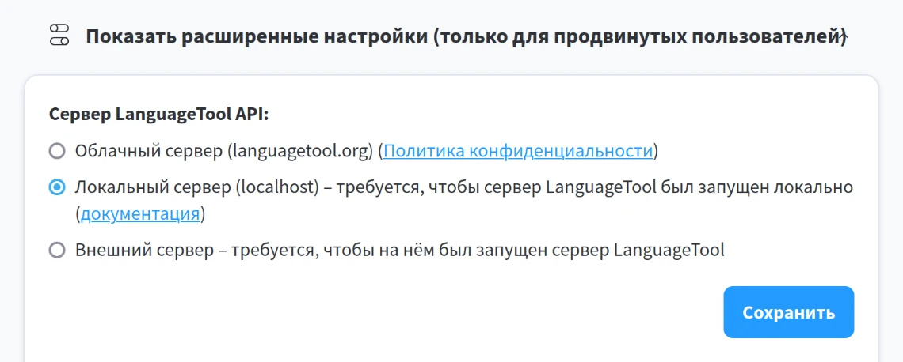
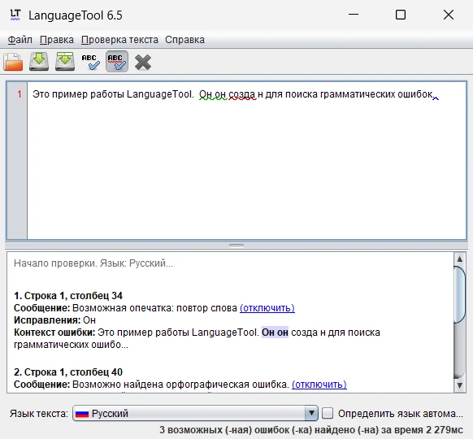

+++
title = 'Локальный сервер LanguageTool'
categories = ['guides', 'privacy', 'selfhost']
publishDate = 2024-11-02T16:33:00Z
lastmod = 2024-11-02T16:33:00Z
description = """Запускайте проверку грамматики LanguageTool на вашем \
компьютере, чтобы повысить уровень вашей конфиденциальности и снизить риск \
утечки данных."""
cover = 'gui.webp'
featured = false
+++

# Локальный сервер LanguageTool


Запускайте проверку грамматики [LanguageTool] на вашем компьютере, чтобы
повысить уровень вашей конфиденциальности и снизить риск утечки данных.

> [!note]
> Локальный сервер LanguageTool не содержит правил на основе искусственного
интеллекта и не совместим с [официальными приложениями] для Windows, macOS и
iOS.

> **Смотрите также:** [Официальная инструкция] (англ.)

[LanguageTool]: /wiki/languagetool
[официальными приложениями]: https://languagetool.org/services#operating_systems
[Официальная инструкция]: https://dev.languagetool.org/http-server

## Системные требования

Вы можете запустить сервер LanguageTool на вашем компьютере (не нужно брать
облачный сервер в аренду) или телефоне Android (через [Termux]). От вас
требуются базовые навыки использования [командной строки].

|||
|-:|:-|
|**Оперативная память**|2 ГБ
|**Java**|Версия 8 и выше

[Termux]: https://termux.dev
[командной строки]: /wiki/cli

## Скачать сервер

Сервер LanguageTool — это файл формата JAR. Его можно запустить на любой
операционной системе, где установлена Java.

### Через пакетные менеджеры

Это неофициальный способ установки, но он рекомендуется для автоматического
разрешения зависимостей и получения обновлений.

- [Homebrew] (macOS/Linux): `brew install languagetool`
- Arch Linux: `sudo pacman -S languagetool`

[Homebrew]: https://brew.sh

### Вручную

1. Установите [Java].
2. Скачайте пакет с [официального сайта] и распакуйте архив.

[Java]: https://java.com/ru/download/help/download_options.xml
[официального сайта]: https://languagetool.org/download/LanguageTool-stable.zip

## fastText

Следующие три шага необязательны, но настоятельно рекомендуются для Linux
(включая Android) и macOS для хорошего определения языка. В Windows fastText
недоступен, и определение языка в LanguageTool будет работать не так хорошо.

1. [Соберите fastText]
2. Скачайте [модели идентификации языка]
3. Создайте файл `server.properties` со следующим содержимым (измените
`/путь/к/fasttext` на путь, куда установлен ваш fastText):

```conf
fasttextModel=/путь/к/fasttext/lid.176.bin
fasttextBinary=/путь/к/fasttext/fasttext
```

[Соберите fastText]: https://fasttext.cc/docs/en/support.html
[модели идентификации языка]: https://fasttext.cc/docs/en/language-identification.html

## Запуск

Если вы устанавливали LanguageTool вручную, то в командной строке перейдите в
распакованный каталог и запустите HTTP-сервер LanguageTool:

```sh
java -cp languagetool-server.jar org.languagetool.server.HTTPServer --port 8081 --allow-origin
```

- `languagetool-server.jar`: Путь к файлу сервера;
- `--port 8081`: Порт (по умолчанию 8081).

Если вы устанавливали fastText, то укажите параметр
`--config server.properties`, где `server.properties` — путь к файлу
конфигурации.


Если вы устанавливали через пакетные менеджеры, например для Arch Linux:

```sh
languagetool --http --config server.properties --port 8081 --allow-origin "*"
```


Если вы устанавливали через Homebrew, то вы можете запустить сервер как фоновую
службу:

```sh
brew services start languagetool
```

> [!tip]
> Для быстрого запуска LanguageTool вы можете добавить alias, ярлык или
настроить автозапуск.

## Использование

После запуска программы в консоли должен отобразиться адрес сервера, по
умолчанию это `http://localhost:8081`. Порт можно сменить параметром `--port`.

Теперь нужно указать адрес сервера в настройках [плагинов]. Пример для
браузерного расширения: Меню расширения → Настройки (значок шестерёнки)
→ Внизу "Показать расширенные настройки" → Локальный сервер.



В целях безопасности сервер не будет доступен с других устройств. Если вы хотите
запустить сервер для удалённых пользователей, используйте опцию `--public`.

[плагинов]: /wiki/languagetool/plugins

## Графический интерфейс

Локальная установка LanguageTool также содержит графический интерфейс. Чтобы
его запустить, откройте файл `languagetool.jar` с помощью Java (или введите
`languagetool` в командной строке, если вы устанавливали через менеджер
пакетов).


