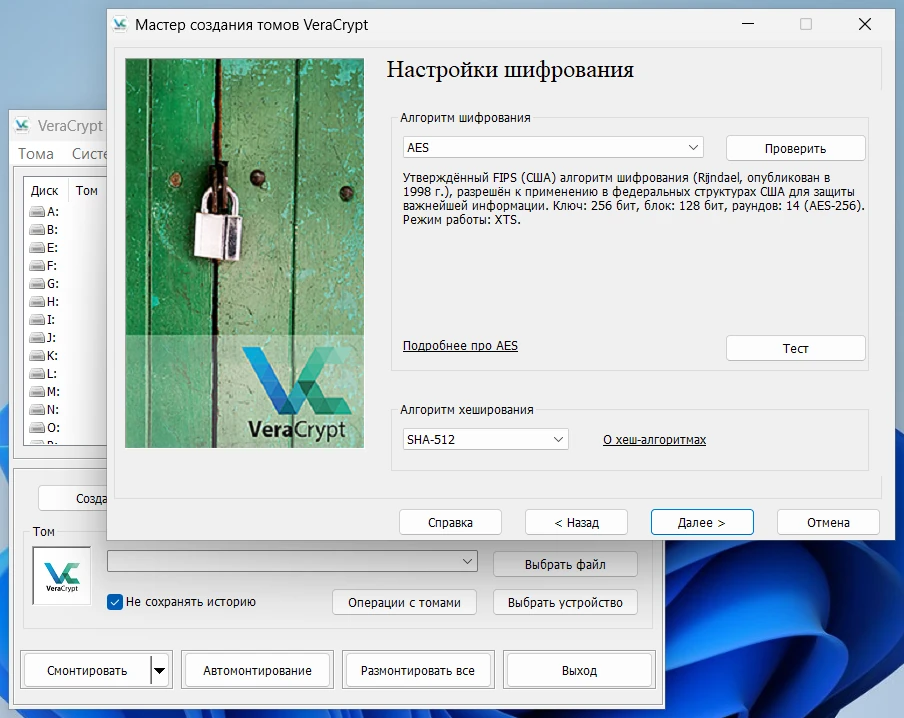

+++
title = 'VeraCrypt'
categories = ['files', 'security']
publishDate = 2023-11-24T17:43:45Z
lastmod = 2024-09-19T19:28:00Z
description = """Создание зашифрованных контейнеров для хранения файлов."""
cover = 'veracrypt.webp'
featured = true
+++

# VeraCrypt


[VeraCrypt] — программа для создания зашифрованных контейнеров, в которых можно
хранить файлы. Контейнеры монтируются как виртуальные диски, но есть возможность
зашифровать весь физический раздел.

VeraCrypt с [открытым исходным кодом], написана на языках C, C++ и Assembly,
доступна бесплатно для Windows, Linux и macOS.

[VeraCrypt]: https://veracrypt.fr
[открытым исходным кодом]: https://veracrypt.fr/code/VeraCrypt

## Применение

Очень важно хранить личные данные (пароли, коды восстановления, документы) в
зашифрованном виде. В случае несанкционированного доступа (утрата или кража
устройства, вирус удалённого доступа) злоумышленник не сможет получить вашу
ценную информацию и воспользоваться ею для своей выгоды.

VeraCrypt позволяет создать надёжное зашифрованное хранилище. Можно читать и
записывать файлы как будто вы используете обычный диск, при этом все данные
шифруются в фоне.

## Устройство

Из [документации](https://veracrypt.fr/ru/Introduction.html):

> <...> Шифрование на лету означает, что данные автоматически зашифровываются
непосредственно перед записью их на диск и расшифровываются сразу же после их
считывания, то есть без какого-либо вмешательства пользователя. Никакие данные,
хранящиеся в зашифрованном томе, невозможно прочитать (расшифровать) без
правильного указания пароля/ключевых файлов или правильных ключей шифрования.
Полностью шифруется вся файловая система (имена файлов и папок, содержимое
каждого файла, свободное место, метаданные и др.). Файлы можно копировать со
смонтированного тома VeraCrypt и на него точно так же, как и при использовании
любого обычного диска (например, с помощью перетаскивания). <...>
>
> Обратите внимание: VeraCrypt никогда не сохраняет на диске никаких данных в
незашифрованном виде – такие данные временно хранятся только в ОЗУ (оперативной
памяти). Даже когда том смонтирован, хранящиеся в нём данные по-прежнему
остаются зашифрованными. При перезагрузке Windows или выключении компьютера том
будет размонтирован, а хранящиеся в нём файлы станут недоступными (и
зашифрованными). Даже в случае непредвиденного перебоя питания (без правильного
завершения работы системы), хранящиеся в томе файлы останутся недоступными (и
зашифрованными). Чтобы получить к ним доступ вновь, нужно смонтировать том (и
правильно указать пароль и/или ключевой файл).

## Установка

Официальная программа VeraCrypt доступна для компьютера (Windows, Linux и
macOS). На данный момент нет планов по разработке официального приложения для
мобильных устройств, однако существуют сторонние реализации.

VeraCrypt доступна бесплатно. Разработка финансируется за счёт [пожертвований].

[пожертвований]: https://veracrypt.fr/en/Donation.html

### Windows

- [Официальный сайт](https://veracrypt.fr/en/Downloads.html)
- [WinGet](/wiki/winget): `winget install veracrypt`

### macOS

- [Официальный сайт](https://veracrypt.fr/en/Downloads.html)

### Linux

- Debian/Ubuntu/Mint: `sudo apt install veracrypt`
- Fedora: `sudo dnf install veracrypt`
- Arch Linux: `sudo pacman -S veracrypt`

### Android

- [EDS Lite](https://f-droid.org/packages/com.sovworks.edslite)

### iOS

- [Disk Decipher](https://apps.apple.com/app/id516538625)
    - [Сайт](https://disk-decipher.app)

## Использование

> **Смотрите также:** Документация на
[русском](https://veracrypt.fr/ru/Documentation.html)
и [английском](https://veracrypt.fr/en/Documentation.html)

### Создание тома

> **Основная статья:**
[Руководство для начинающих](https://veracrypt.fr/ru/Beginner%27s%20Tutorial.html)

Для начала необходимо создать том, в котором будут храниться зашифрованные
данные. Нажмите на соответствующую кнопку в главном окне программы, чтобы
запустить Мастер создания томов.

Тип тома **«Зашифрованный файл-контейнер»** создаст файл, который можно будет
смонтировать как виртуальный диск. **«Раздел или диск без системы»** полностью
зашифрует накопитель, и для доступа к нему нужно воспользоваться программой
VeraCrypt.

Настройки шифрования для большинства пользователей следует оставить по
умолчанию.

Укажите размер тома — это его постоянная величина, которую нельзя изменить без
пересоздания тома. Для Windows есть возможность расширения тома, но это
[имеет проблемы](https://superuser.com/a/1512506).

Пароль для тома должен быть достаточно надёжным. Его можно сменить в будущем.
Если вы потеряете или забудете пароль, то навсегда лишитесь доступа к вашим
зашифрованным файлам. Если кто-то получит доступ к паролю и зашифрованному тому,
то сможет расшифровать ваши файлы.

Последний этап — форматирование тома. Хаотично перемещайте мышь в пределах окна
мастера создания томов в течение хотя бы 30 секунд. Чем дольше вы будете
перемещать мышь, тем значительнее повысите надёжность ключей шифрования и
снизите вероятность взлома перебором.

Для завершения нажмите кнопку **Разметить**. Будет создан файл в ранее
указанном месте. Этот файл и будет являться зашифрованным контейнером. Теперь
вы можете **смонтировать том**.

### Монтирование тома

В главном меню выберите точку монтирования (букву диска), а затем файл или
устройство, которое является зашифрованным томом.

Нажмите на кнопку **«Смонтировать»** и введите пароль.

После расшифровки в указанной точке монтирования (букву диска) появится
виртуальный (или физический) диск, на который можно записать какие-либо файлы.

> [!important]
> После того, как вы скопируете существующие незашифрованные файлы на том
VeraCrypt, вы должны надёжно удалить (затереть) исходные незашифрованные файлы.
Удаление через интерфейс операционной системы лишь разрешит запись данных
вместо удалённых файлов, поэтому их можно будет восстановить. Для надёжного
стирания существуют специальные программы.

После завершения работы с томом, вы можете его размонтировать. В таком случае
содержимое станет недоступным, пока вы не введёте пароль. Размонтирование
происходит автоматически при выключении или перезагрузке компьютера.

## Альтернативы

**Системы шифрования:**

- [gocryptfs](https://nuetzlich.net/gocryptfs) (Go)
- [CryFS](https://www.cryfs.org) (C++)
- [EncFS](https://vgough.github.io/encfs) (C++)

**Реализации:**

|Программа|Платформа|Системы шифрования|
|:-------:|:-------:|:----------------:|
|[DroidFS]|Android|gocryptfs, CryFS
|Хранилища (Vaults) в [KDE Plasma]|Linux|gocryptfs, CryFS, EncFS
|[cppcryptfs]|Windows|gocryptfs

[DroidFS]: https://github.com/hardcore-sushi/DroidFS#readme
[KDE Plasma]: https://kde.org/plasma-desktop
[cppcryptfs]: https://github.com/bailey27/cppcryptfs#readme
