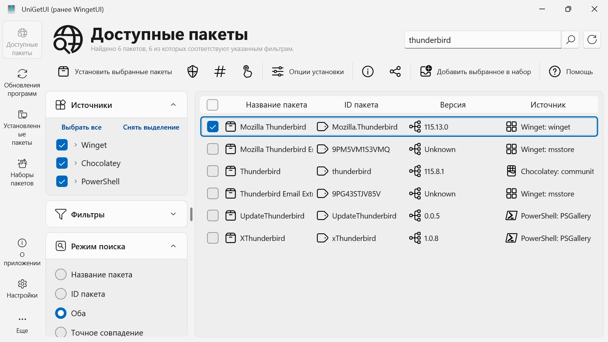

+++
title = 'WinGet'
categories = ['windows']
publishDate = '2023-09-21T16:39:58Z'
lastmod = '2024-07-26T14:00:00Z'
summary = """Официальный пакетный менеджер для Windows, предоставляющий \
возможность искать, устанавливать, обновлять и удалять программы, используя \
консольный интерфейс."""
cover = '/media/winget.webp'
featured = true
+++

# WinGet


[WinGet](https://github.com/microsoft/winget-cli) — официальный пакетный
менеджер для Windows, предоставляющий возможность искать, устанавливать,
обновлять и удалять программы, используя консольный интерфейс.


## Применение

На большинстве операционных систем получение программ происходит через магазины
приложений (также будем их называть репозиториями). Так как они являются общим
каталогом, то очень удобно искать нужные приложения и обновлять их.

На Windows же, несмотря на наличие Microsoft Store, основным способом получения
приложений является поиск установщиков в интернете. Это менее удобно, а также
небезопасно:
[Google](https://www.bleepingcomputer.com/news/security/google-ad-for-gimporg-served-info-stealing-malware-via-lookalike-site)
и [Яндекс](https://t.me/KoolTechTricks/131) могут выдавать рекламу поддельных
программ. WinGet решает эту проблему, добавляя репозиторий со ссылками на
установщики программ. Пользователю остаётся лишь написать название приложения,
чтобы автоматически установить его.

Распространённой проблемой в последних версиях Windows является установка
браузера, которой препятствует сам Microsoft Edge. При помощи WinGet, можно
установить желаемый браузер одной консольной командой, не запуская Edge.

## Установка

WinGet должен быть встроен в последние версии Windows 10 (1709 и позднее) и 11 в
составе установщика приложений. Убедитесь, что он
[обновлён](https://www.microsoft.com/p/app-installer/9nblggh4nns1),
так как после установки Windows может быть предустановлена старая версия. Также
вы можете установить .msixbundle с
[GitHub](https://github.com/microsoft/winget-cli/releases/latest). В случае
возникновения проблем смотрите раздел
[Исправление проблем](#исправление-проблем).

Из [справки Microsoft](https://learn.microsoft.com/ru-ru/windows/package-manager/winget/#install-winget):

> Средство winget не будет доступно, пока вы не вошли в Windows в качестве
пользователя впервые <...>. Если вы недавно вошли в систему как пользователь
впервые и обнаружите, что winget еще недоступен, вы можете открыть PowerShell и
ввести следующую команду <...>:
`Add-AppxPackage -RegisterByFamilyName -MainPackage Microsoft.DesktopAppInstaller_8wekyb3d8bbwe`

## Устройство

Репозиторий WinGet хранит манифесты, содержащие ссылки на установщики программ и
скрипты установки. Он поддерживается
[сообществом](https://github.com/microsoft/winget-pkgs) — каждый может добавить
отсутствующие программы. Манифесты имеют удобное название `Компания.Приложение`.
Чаще всего программы актуальной версии, но иногда могут быть устаревшими.

Скрипты установки обычно направлены на тихую установку и автоматическую
настройку.

Установленные классическим способом приложения могут быть уже доступны для
управления ими в WinGet.

Также WinGet может устанавливать приложения из Microsoft Store.

## Использование


> [!note]
> WinGet имеет только консольный интерфейс, то есть необходимо вводить команды в
терминал (`cmd`). Вы можете почитать
[руководство по использованию консольного интерфейса](/wiki/cli) или
воспользоваться [сторонним графическим интерфейсом](#third-party-apps).


Типичное использование WinGet:

1. Поиск нужного приложения: `winget search <запрос>`
2. Установка приложения по его идентификатору:
`winget install <Компания.Приложение>`
3. Обновление всех приложений: `winget update --all`


> [!tip]
> Можно пропустить поиск приложения и написать запрос в команду `install`. Если
результат поиска единственный — приложение будет установлено, если нет — будут
предложены варианты.


Для получения помощи, необходимо использовать параметр `--help` или не закончить
команду.

### Поиск

```powershell
winget search <запрос> [параметры]
```

Ищет приложения в доступных источниках. Принимаются параметры для сортировки
и фильтрации результатов.

### Установка

```powershell
winget install <запрос(ы...)> [параметры]
```

Устанавливает указанные приложения.

Принимаются либо уникальные названия приложений, либо их идентификаторы в
формате `Компания.Приложение`.

Параметры:

- `-i` — интерактивная (классическая) установка
- `-h` — автоматическая (тихая) установка
- `-l` — путь установки (если поддерживается)
- `-v`, `--version` — указать версию приложения. По умолчанию последняя.

### Удаление

```powershell
winget uninstall <запрос(ы...)> [параметры]
```

Параметры:

- `-i` — интерактивное (классическое) удаление
- `-h` — автоматическое (тихое) удаление

### Обновление

```powershell
winget update <запрос(ы...)> [параметры]
```

Эта команда без параметров отобразит список доступных обновлений.

Параметры:

- `-i` — интерактивное (классическое) обновление
- `-h` — автоматическое (тихое) обновление
- `-l` — путь установки (если поддерживается)
- `-r`, `--all` — обновить все пакеты до последней версии

### Список

```powershell
winget list
```

Отобразить список приложений, установленных на компьютере в настоящий момент, а
также показать доступность обновлений.

Вы можете использовать параметры для сортировки и фильтрации результатов.

### Экспорт и импорт

При переустановке системы хочется иметь список приложений для автоматической
установки. Вы можете создать такой список командой `export`:

```powershell
winget export <путь_к_файлу>
```

Список можно импортировать командой `import`, и все приложения будут
установлены:

```powershell
winget import <путь_к_файлу>
```

## Сторонние приложения

Вы можете воспользоваться этими сторонними приложениями, которые упрощают
использование WinGet, добавляя к нему графический интерфейс и дополнительные
возможности.

### UniGetUI

[UniGetUI] (ранее WingetUI) — графический интерфейс для консольных пакетных
менеджеров в Windows. С помощью него вы сможете искать, устанавливать, обновлять
и удалять программы через WinGet, Chocolatey, Scoop, а также Pip, Npm, .NET Tool
и PowerShell.

UniGetUI предоставляет простой интерфейс, просмотр информации о приложениях,
автообновление, экспорт настроек и списка установленных программ.



[UniGetUI]: https://www.marticliment.com/unigetui

### WinUtil

[WinUtil](https://github.com/ChrisTitusTech/winutil) — сборник инструментов для
первоначальной настройки Windows: установка программ, модификации, исправления и
обновления.

Одна из функций — установка программ — находится во вкладке Install. Здесь
собрано огромное множество нужных программ, которые можно установить в пару
нажатий без необходимости искать их в интернете. Также программы можно обновить,
удалить; экспортировать и импортировать список. Для управления установленными
приложениями используется WinGet, Scoop и Chocolatey.

Установка не требуется, достаточно написать команду в PowerShell от имени
администратора:

```powershell
irm https://christitus.com/win | iex
```

Эта команда запустит скрипт, который установит недостающие компоненты и откроет
главное окно. За журналом действий можно наблюдать в терминале.


Среди исправлений также можно найти переустановку WinGet.

## Исправление проблем

Убедитесь, что у вас установлена последняя версия WinGet. Проверьте наличие
обновлений в
[Microsoft Store](https://www.microsoft.com/p/app-installer/9nblggh4nns1) или
установите .msixbundle с
[GitHub](https://github.com/microsoft/winget-cli/releases/latest).

Если не удалось обновить источник winget, то попробуйте установить пакет
[source.msix](https://winget.azureedge.net/cache/source.msix).

## Смотрите также

- [Документация на русском](https://learn.microsoft.com/ru-ru/windows/package-manager/winget)
(неаккуратный перевод)
- [Документация на английском](https://learn.microsoft.com/en-us/windows/package-manager/winget)
